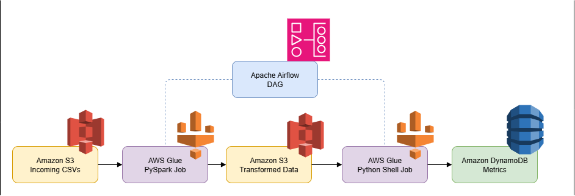
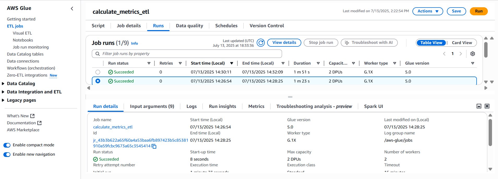
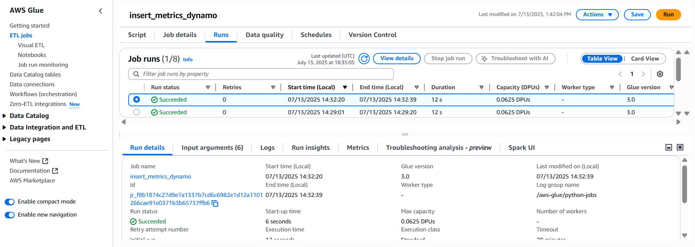
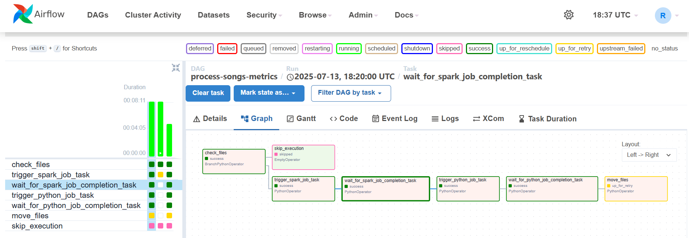
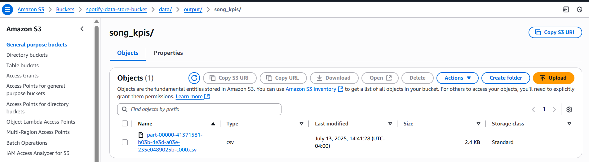
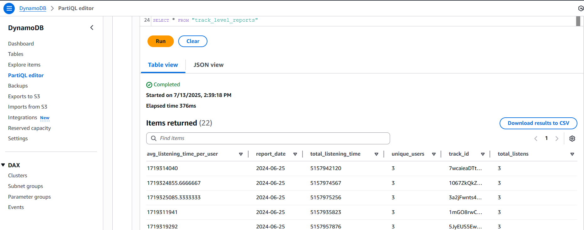

# Distributed Music Streams Processing Lab



---

## 🎯 Business Goal
Provide **near‑real‑time listener & track analytics** without the complexity of a full‑blown streaming stack:

* Random user‑stream events are landed as small CSV objects in an S3 *incoming* prefix.
* An **Apache Airflow** DAG checks that prefix every **5 minutes**. When files exist, it kicks off processing—otherwise it simply sleeps until the next tick.
* **AWS Glue (PySpark)** cleanses, enriches, and converts the data to columnar Parquet.
* A follow‑up **Glue Python‑Shell** task aggregates and upserts metrics into **Amazon DynamoDB**, where dashboards & Lambda APIs read them instantly.

This micro‑batch design acts "stream‑like" while staying cost‑efficient and serverless.

---

## ⚙️ Pipeline Steps

| # | Airflow Task  | Purpose | Success Proof |
|---|--------------|---------|----------------|
| 1 | **`check_files`** | Detect new CSVs in `s3://music-streams/incoming/`. | – |
| 2 | **`glue_pyspark`** | Transform & repartition → Parquet in curated S3 prefix. |  |
| 3 | **`glue_dynamo`** | Aggregate & upsert into DynamoDB. |  |
| 4 | **`move_files`** | Archive raw CSVs to `s3://music-streams/archive/DATE/`. | – |

Overall DAG window:



Intermediate & final outputs:





---

## 🗂️ Repository Layout
```text
├─ data/images/                 # PNGs & diagrams
├─ dag-glue-workflow.py         # Airflow DAG (orchestrator)
├─ glue-pyspark.py              # Spark ETL script
├─ glue-dynamo.py               # DynamoDB loader script
├─ local-docker-development.sh  # LocalStack + Airflow helper
└─ README.md                    # You’re reading it ✔︎
```

---

## 🚀 Quick Start (Local)
```bash
# Boot LocalStack + Airflow
sh local-docker-development.sh

# Upload sample CSV
aws --endpoint-url=http://localhost:4566 \
    s3 cp sample_plays.csv s3://music-streams/incoming/
```
The DAG will auto‑trigger within the next 5‑minute cycle and push results to the local DynamoDB table.

---

